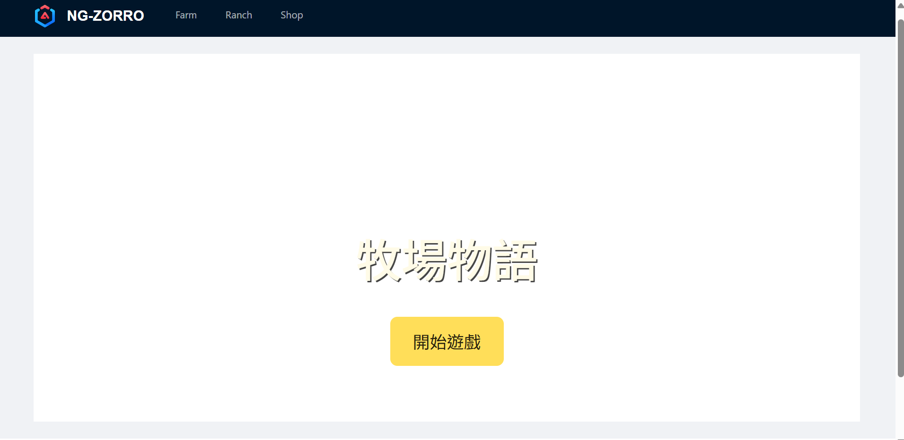
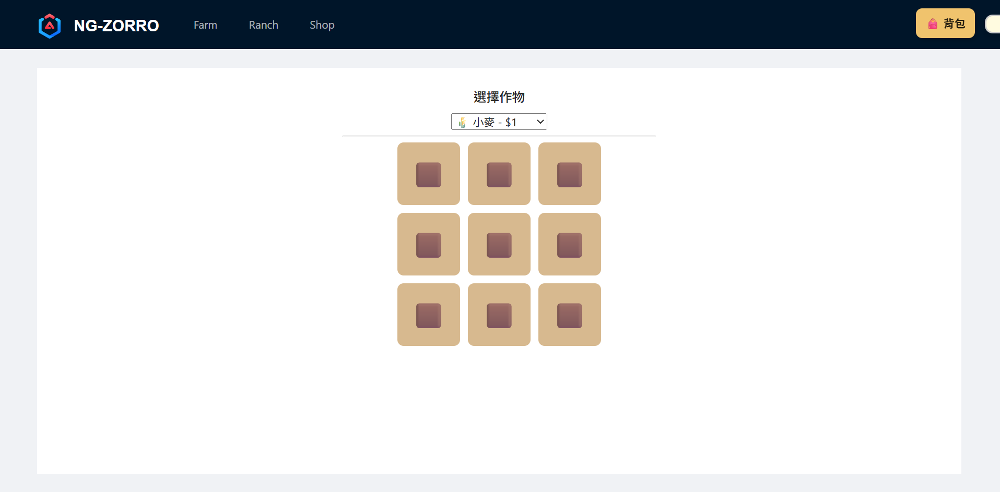
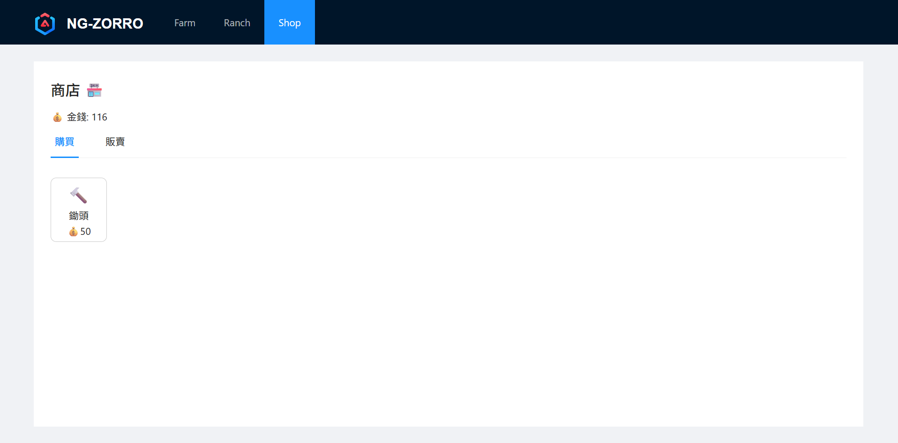

# 🌾 FarmGame
目前正在學習angular開發
一個使用 **Angular** 開發的簡易農場小遊戲，支援作物種植、背景生長、收穫、背包管理與商店買賣功能。  
玩家可以在農田種植作物，收穫後賣到商店賺取金錢，並升級背包容量。

---

## 🎮 功能特色

- **農田系統**
  - 9 格農田，可種植多種作物
  - 作物有成長時間，採用背景生長模式（即使換頁或重整也會繼續成長）
  - 支援收穫農作物並存入背包

- **背包系統**
  - 初始容量 20，可花錢升級
  - 存放農作物、種子、工具等道具
  - 可收合/展開背包界面

- **商店系統**
  - 玩家可以購買種子或工具
  - 出售農作物賺取金錢
  - 商店商品由 `shop-item.data.ts` 統一管理

- **遊戲存檔**
  - 使用 LocalStorage 保存金錢、作物狀態、背包內容
  - 即使重新整理或關閉瀏覽器，遊戲進度仍會保存

---

## 🖼️ 遊戲截圖

> ⚡ 以下為示意圖，完成 UI 後可放上實際截圖

- **遊戲首頁**
  

- **農田畫面**
  

- **商店與背包**
  

> 💡 建議將截圖存放於 `docs/screenshots/` 資料夾，方便 GitHub 讀取。

---

## 🛠️ 專案結構

```

src/app
├─ core
│  └─ game-state         # 全域遊戲狀態管理與存檔
│
├─ entities
│  ├─ crop               # 作物資料與服務
│  ├─ farm-plot          # 農田格
│  ├─ game-state         # 全域遊戲狀態管理與存檔
│  ├─ inventory          # 背包功能（元件與服務）
│  └─ item               # 基礎物品定義
│
├─ features
│  ├─ farm               # 農田功能（種植、收穫）
│  └─ shop               # 商店功能（買賣物品）
│
├─ pages
│  ├─ home               # 遊戲首頁
│               
└─ shared                # 共用元件或管道

````

---

## 📖 後續規劃

* 農作物生長動畫與進度條
* 更多種子與農作物
* 道具系統（澆水、施肥）
* 任務與成就系統
* GitHub Pages 或 Vercel Demo

---

## 🧑‍💻 開發環境

- **Node.js**: `22.16.0` (建議使用此版本或更新的 LTS 版本)
- **npm**: `10.9.2`
- **Angular CLI**: `20.1.3`
- **TypeScript**: `5.8.3`

### 2. 環境設定步驟

1.  **安裝 Node.js 和 npm**：
    如果你尚未安裝，請從 [Node.js 官方網站](https://nodejs.org/) 下載並安裝。安裝 Node.js 時會一併安裝 npm。

2.  **安裝 Angular CLI**：
    在你的終端機中執行以下指令來安裝 Angular CLI 全域套件：
    ```bash
    npm install -g @angular/cli
    ```
### 3. 啟動開發伺服器

1.  **啟動開發伺服器**：
    ```bash
    ng serve
    ```
2.  **瀏覽應用程式**：
    打開你的瀏覽器，並訪問 `http://localhost:4200/`。應用程式將會自動重新載入，方便你進行即時開發。

### 4. 建置專案

1.  **建置專案**：
    ```bash
    ng build
    ```

    生成檔案會在 `dist/` 目錄。

---